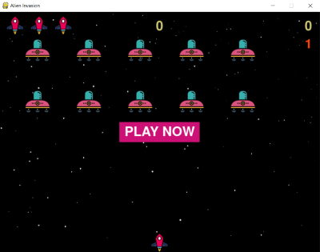

#  SPACE INVADER 

### About 
A simple pygame I created from scratch. An alien invasion is a two-dimensional fixed shooter game in which the player controls the ship while shooting at descending alien space ships. The player will shoot with laser cannon and as the player shooting ability improve, the game will get more intense. So prep yourself. 

Open alien_invasion.py and run the program. Make sure Pygame is including in your python packages. **Note:** Make sure all the file stay in the same directory as the images and the rest .py files. 

The game is simple and easy to play :) 

### How To Play 

- To Play: Click the button to 'play'
- Moving the ship: Press the arrow key Right and Left 
- To shoot: Press the Space Bar

#### Note to players.
The game is still under development. I will add more features as my programming skill develop. So stay tuned ;)
